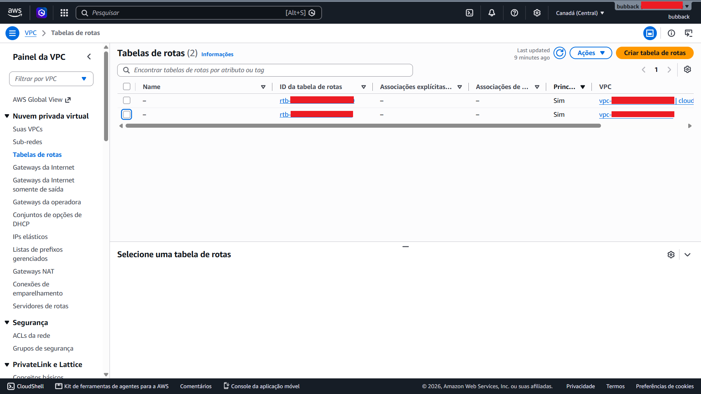
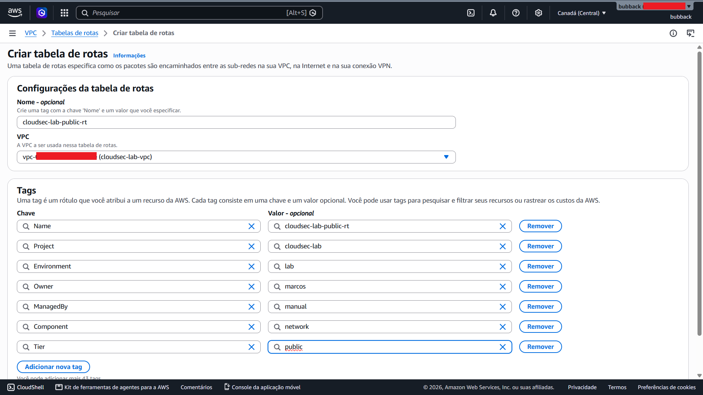
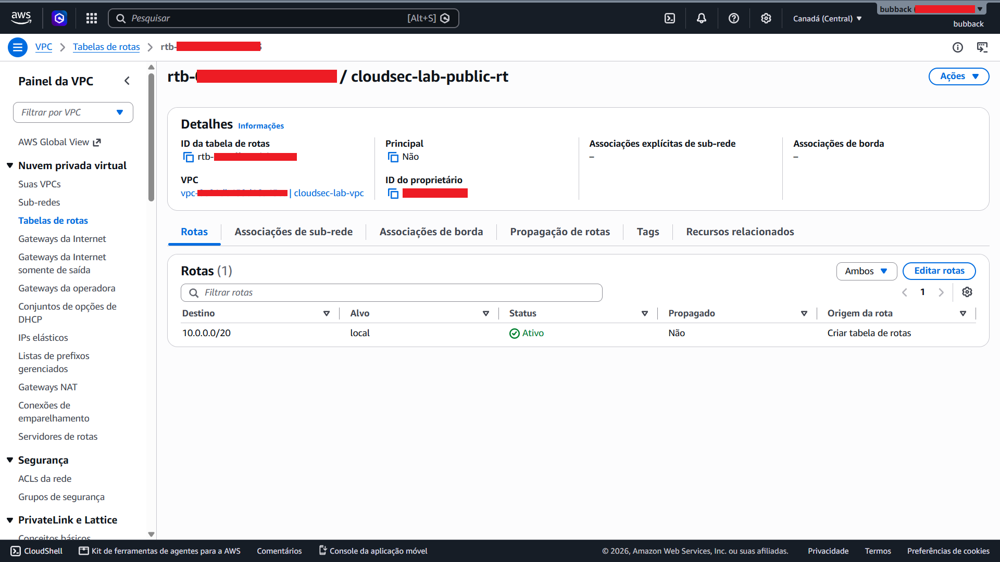
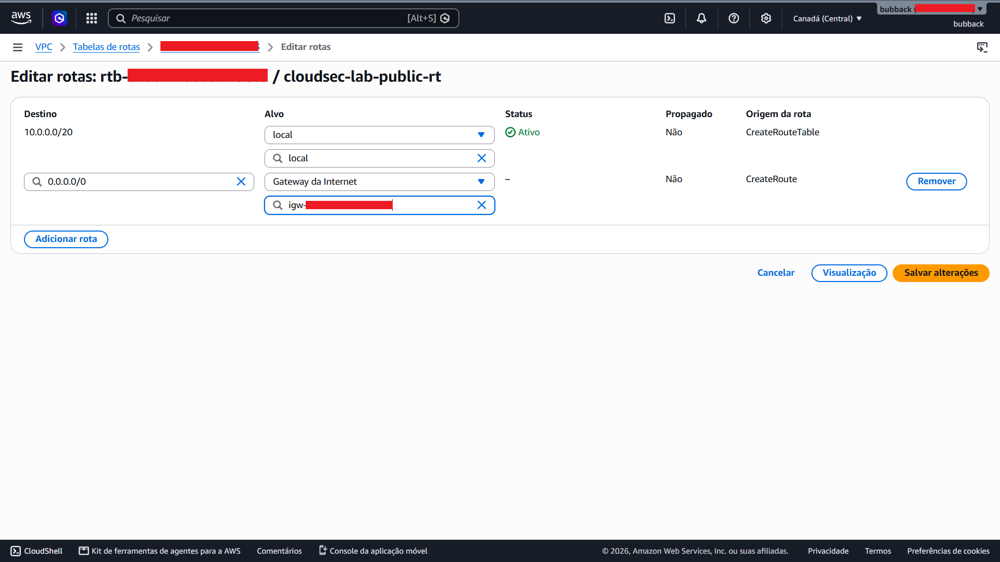
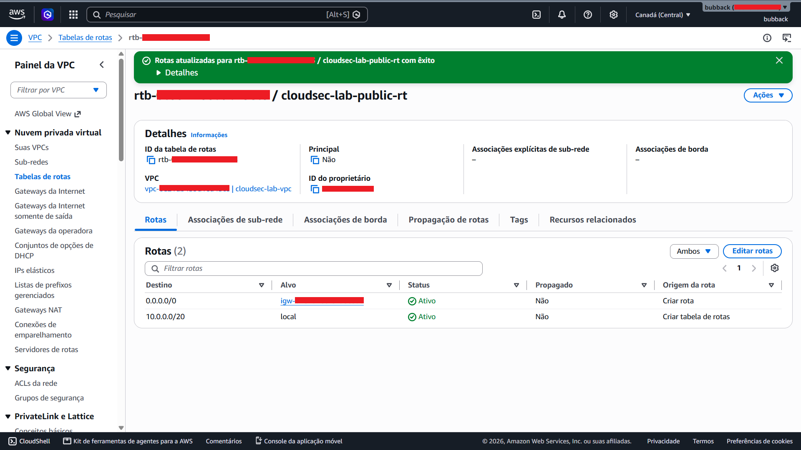
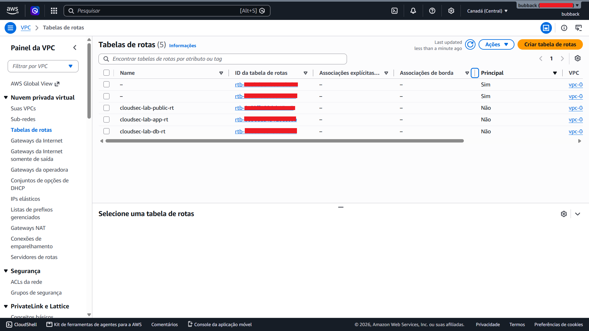
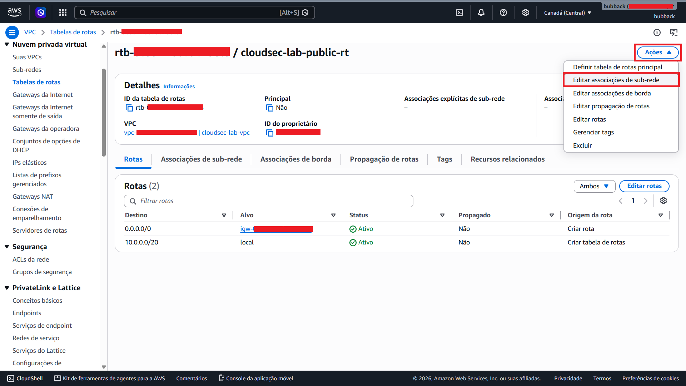
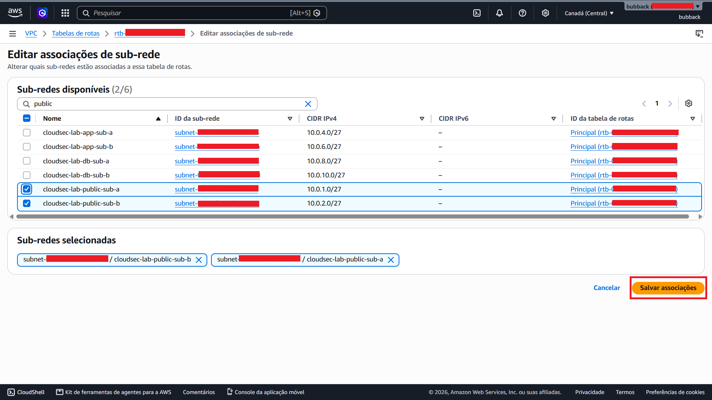

# Implementação do Laboratório Fase 2 (Route Tables/Security Groups/NACLs)

Após a implementação da VPC, das sub-redes e do Internet Gateway (IGW), partimos para as configurações de roteamento (Route Tables) e de controle de tráfego (Security Groups e NACLs).

&nbsp;

## Criação e Associação das Route Tables

As imagens a seguir demonstram a criação manual da tabela de rotas, especificamente a tabela de rotas pública, e sua posterior associação às sub-redes públicas da infraestrutura.

> **Nota:** Para não poluir esta parte do material com muitas imagens, registrei apenas a criação e associação da tabela de rotas pública. No total, foram criadas três tabelas de rotas: pública, aplicação e banco de dados, cada uma associada às suas respectivas sub-redes.
>

&nbsp;

&nbsp;

## Criação e Associação dos Security Groups

Em seguida, passei para a implementação dos Security Groups, um dos principais mecanismos de controle de tráfego utilizados na infraestrutura de rede da AWS.

Na infraestrutura proposta para o laboratório, até o momento, temos três grupos de segurança:

* **Security Group do Application Load Balancer (ALB)**

* **Security Group da camada de aplicação**

* **Security Group da camada de banco de dados**

&nbsp;

As imagens a seguir apresentam o processo de criação dos Security Groups e a configuração das respectivas regras de tráfego, incluindo as permissões de entrada e saída definidas para cada componente da arquitetura.

Essas regras foram configuradas fazendo referência aos Security Groups correspondentes, em vez de endereços IP ou sub-redes específicas, permitindo que o controle de acesso seja baseado diretamente na relação entre os componentes da arquitetura.

