# Implementação do Laboratório (vpc/sub-redes/internet gateway)

Imediatamente após a fase de preparação, iniciei efetivamente a implementação do laboratório. No console da AWS, o primeiro passo foi a criação da VPC, processo que pode ser visualizado abaixo.

&nbsp;

## Criação da VPC

No console da AWS, o primeiro passo foi a criar a VPC, como visto nas figuras a seguir.

&nbsp;
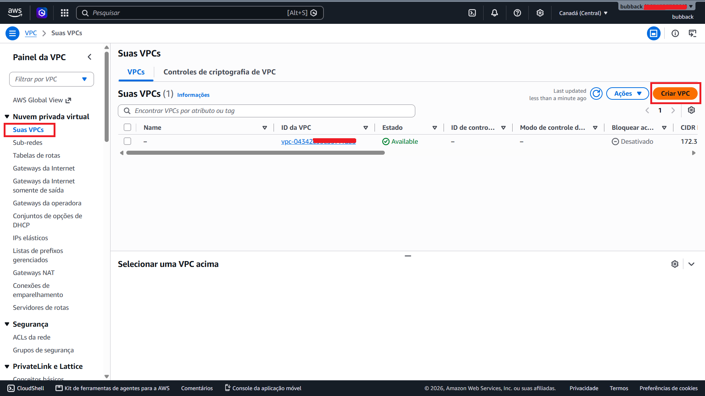

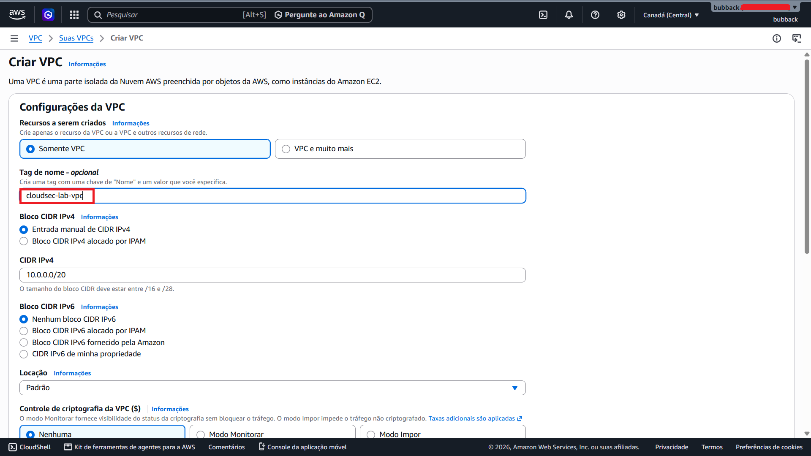

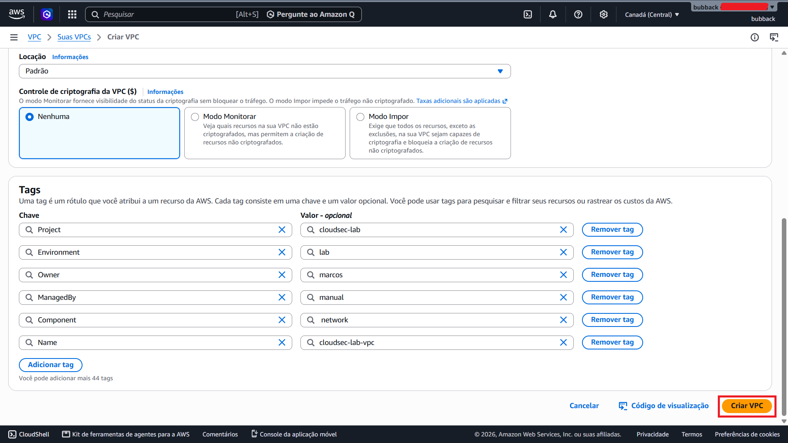

A imagem a seguir mostra que a VPC foi criada com sucesso.

&nbsp;
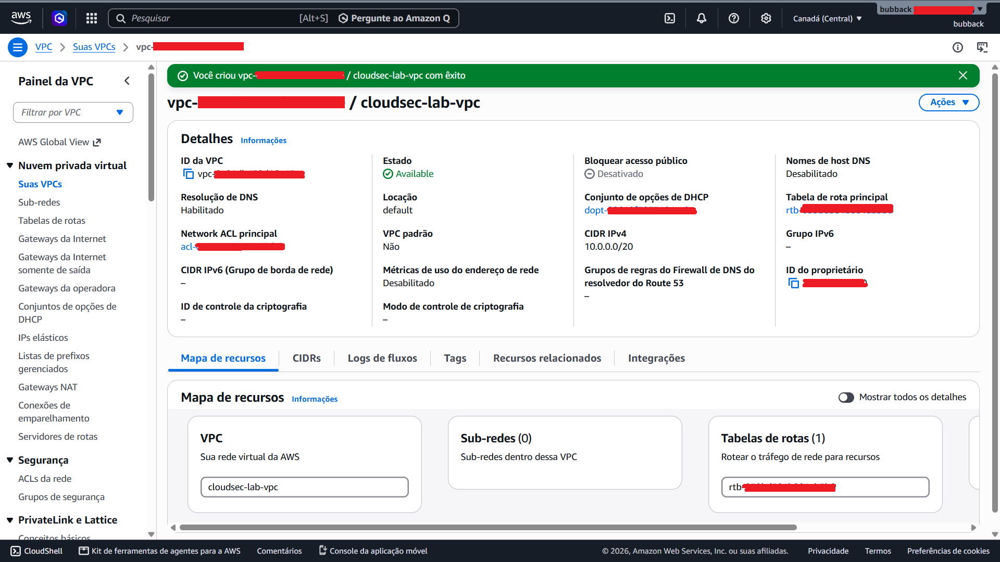

## Criação das Sub-redes

Após criar a VPC, ainda no console da AWS, parti para a criação das sub-redes, conforme definido no material de planejamento.

As figuras a seguir exibem a criação da primeira sub-rede. No entanto, todas as sub-redes foram criadas manualmente, com o objetivo de internalizar o processo e os conceitos relacionados.

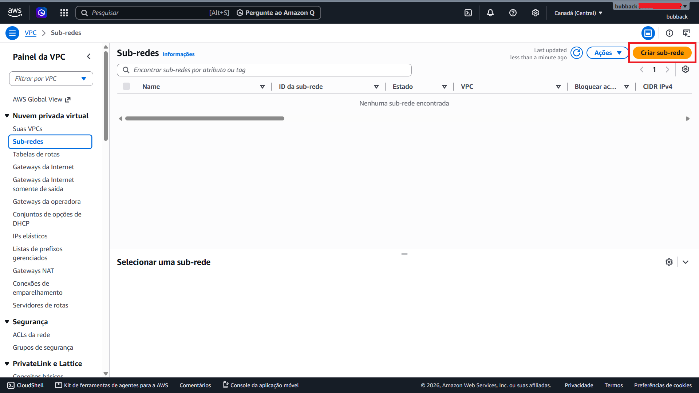

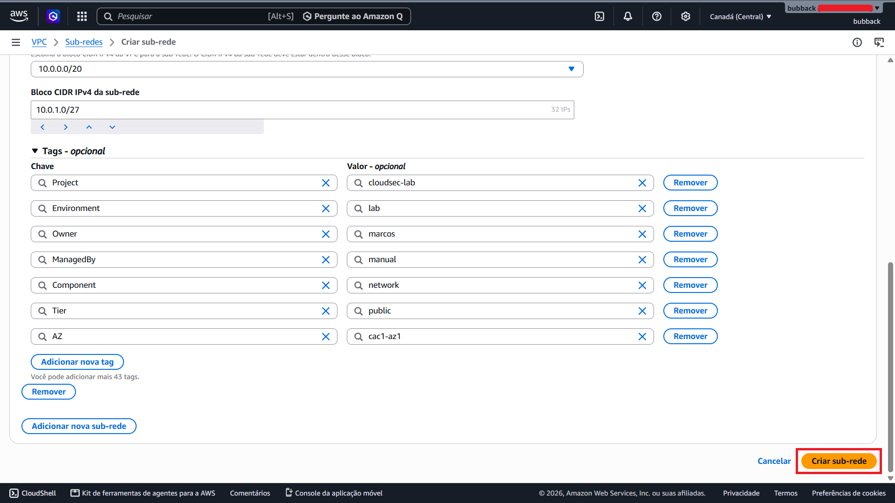

Na imagem a seguir, é possível visualizar a lista das sub-redes criadas, conforme a infraestrutura proposta.

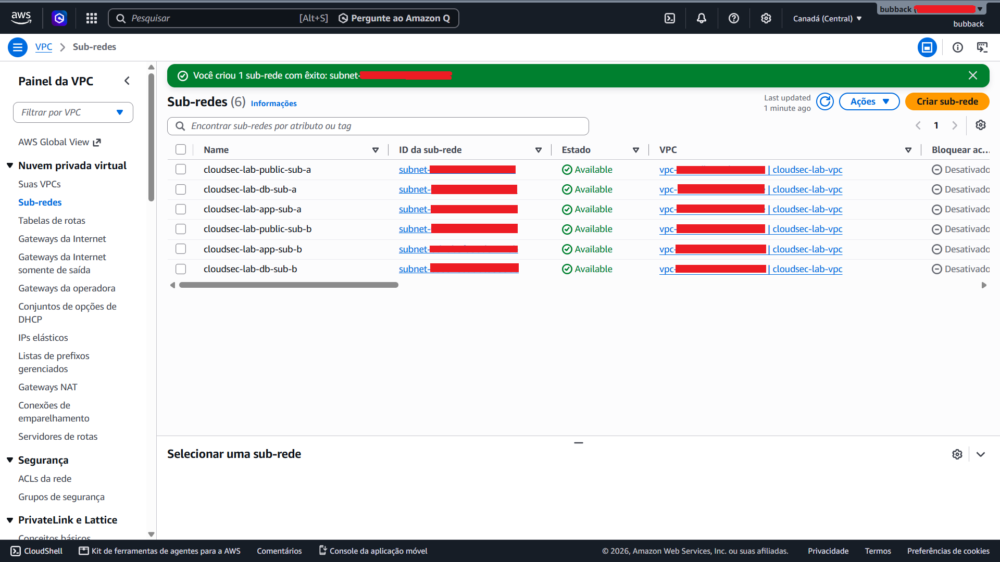

## Criação do Internet Gateway

Após a criação das sub-redes, parti para a criação do Internet Gateway e sua associação à VPC do laboratório, conforme pode ser visto nas imagens a seguir.

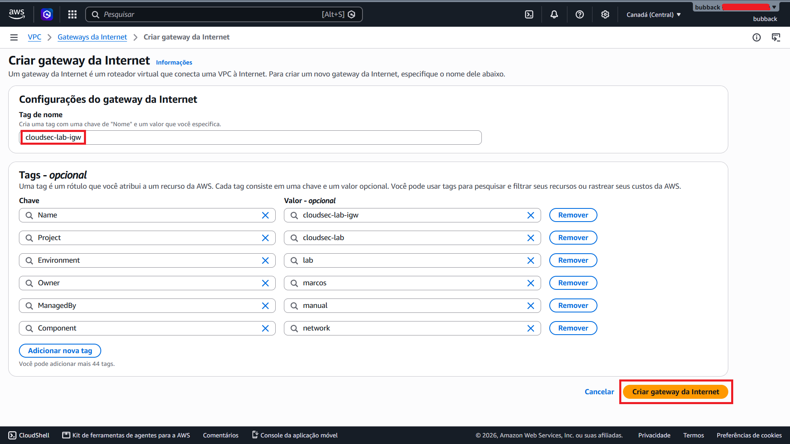

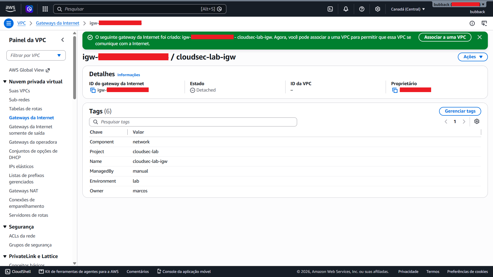

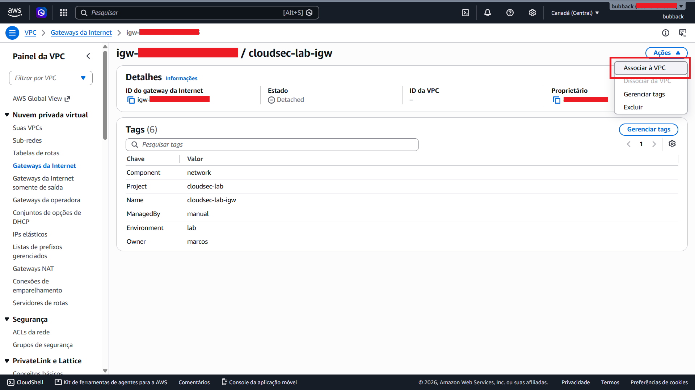

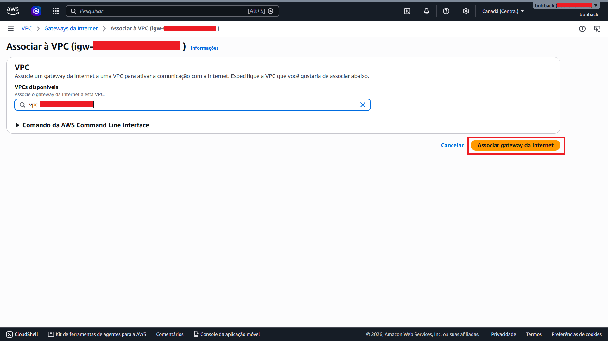

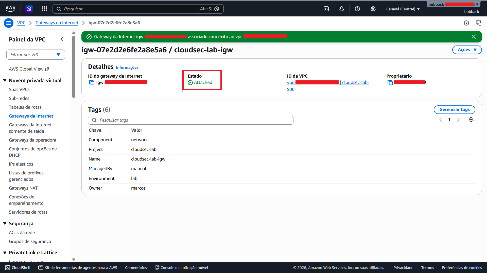

